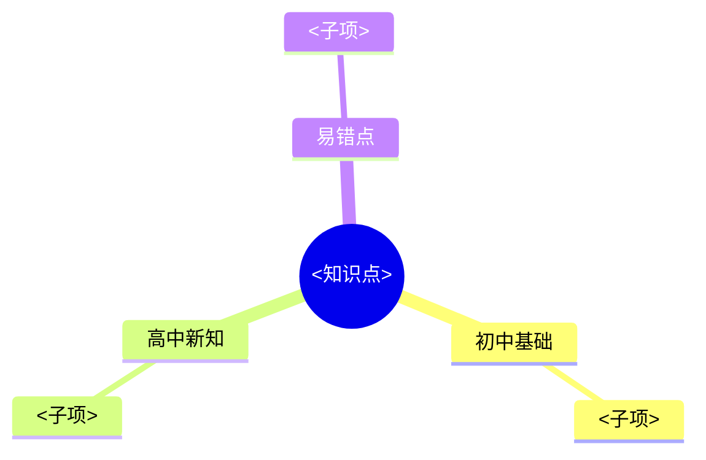

# 高中预习项目实施计划

> **For agentic workers:** REQUIRED SUB-SKILL: Use superpowers:subagent-driven-development (recommended) or superpowers:executing-plans to implement this plan task-by-task. Steps use checkbox (`- [ ]`) syntax for tracking.

**Goal:** 搭建 `high-school-prep` 开源仓库骨架，使 Claude Code 可在根目录按 CLAUDE.md 约束为初中毕业生预习高一全科生成知识点讲解、互动演示、题目 PDF、追问等内容。

**Architecture:** 分层约束 — 根 `CLAUDE.md` 全局硬约束 + 每科 `README.md` 科内规则 + 共享 `templates/`（PDF/HTML/Markdown 模板）+ `scripts/` 编译工具 + 5 个科目同构目录。

**Tech Stack:** Pandoc + XeLaTeX（PDF 生成）、vanilla JS + KaTeX CDN（HTML 演示）、Python matplotlib/numpy（即时可视化）、Bash（编译脚本 + 冒烟测试）、Markdown（知识点讲解）。

## Global Constraints

- 学习者：初中毕业暑期预习高一全科，人教版教材
- 5 科目目录：`chinese/` `math/` `physics/` `chemistry/` `english/`，每科固定结构 `README.md`/`progress.md`/`mistakes.md`/`knowledge/`/`questions/`
- 题目源 Markdown + LaTeX 公式（`$...$` 行内，`$$...$$` 块级）
- 题目 PDF：pandoc + xelatex，模板 `templates/question-pdf.tex`
- 题干后留至少 6 行 `\vspace` 作答空白；答案集中在最后一页 `\newpage` 后
- 文件名：`questions/YYYY-MM-DD_<知识点>_<难度>_<序号>.md`，同名 `.pdf`
- 难度三档：基础 / 巩固 / 拔高
- 全部中文生成内容，技术术语可英文
- MIT 协议，仓库名 `high-school-prep`
- 公式 LaTeX 语法，渲染库由模板决定

---

## File Structure

| 文件 | 职责 |
|------|------|
| `LICENSE` | MIT 协议全文 |
| `README.md` | 项目说明（开源用户入门） |
| `.gitignore` | 忽略 PDF 中间产物、`.DS_Store` |
| `CLAUDE.md` | 全局硬约束（角色、教学原则、目录、生成规则） |
| `templates/question-pdf.tex` | Pandoc PDF 题目模板 |
| `templates/demo.html` | HTML 互动演示骨架 |
| `templates/knowledge.md` | 知识点讲解模板 |
| `scripts/build-pdf.sh` | pandoc → xelatex 编译脚本 |
| `scripts/check-env.sh` | 环境前置检查 |
| `tests/sample-questions.md` | PDF 模板冒烟样例 |
| `tests/test-build-pdf.sh` | PDF 生成冒烟测试 |
| `tests/test-env-check.sh` | env 脚本测试 |
| `tests/test-scaffold.sh` | 科目目录骨架测试 |
| `tests/test-templates.sh` | 模板完整性测试 |
| `math/README.md` `physics/README.md` `chemistry/README.md` `chinese/README.md` `english/README.md` | 每科科内约束 |
| `math/progress.md` 等 5 个 | 知识点状态表 + 当日总结区 |
| `math/mistakes.md` 等 5 个 | 错题索引 |

---

## Task 1: 仓库基础文件

**Files:**
- Create: `LICENSE`
- Create: `README.md`
- Create: `.gitignore`

**Interfaces:**
- Produces: 仓库根元数据，所有后续任务依赖仓库已初始化

- [ ] **Step 1: 写 `LICENSE`（MIT，年份 2026，持有人 roast）**

```text
MIT License

Copyright (c) 2026 roast

Permission is hereby granted, free of charge, to any person obtaining a copy
of this software and associated documentation files (the "Software"), to deal
in the Software without restriction, including without limitation the rights
to use, copy, modify, merge, publish, distribute, sublicense, and/or sell
copies of the Software, and to permit persons to whom the Software is
furnished to do so, subject to the following conditions:

The above copyright notice and this permission notice shall be included in all
copies or substantial portions of the Software.

THE SOFTWARE IS PROVIDED "AS IS", WITHOUT WARRANTY OF ANY KIND, EXPRESS OR
IMPLIED, INCLUDING BUT NOT LIMITED TO THE WARRANTIES OF MERCHANTABILITY,
FITNESS FOR A PARTICULAR PURPOSE AND NONINFRINGEMENT. IN NO EVENT SHALL THE
AUTHORS OR COPYRIGHT HOLDERS BE LIABLE FOR ANY CLAIM, DAMAGES OR OTHER
LIABILITY, WHETHER IN AN ACTION OF CONTRACT, TORT OR OTHERWISE, ARISING FROM,
OUT OF OR IN CONNECTION WITH THE SOFTWARE OR THE USE OR OTHER DEALINGS IN THE
SOFTWARE.
```

- [ ] **Step 2: 写 `README.md`**

```markdown
# high-school-prep

初高衔接自学项目。Claude Code 在本仓库根目录运行，按 `CLAUDE.md` 全局约束为初中毕业生预习高一全科生成内容。

## 覆盖科目

- 语文 `chinese/`
- 数学 `math/`
- 物理 `physics/`
- 化学 `chemistry/`
- 英语 `english/`

## 功能

- 知识点讲解（衔接初中 → 高中新知，附自检问题）
- 互动演示（HTML+JS 持久页面 + Python 即时可视化）
- 按难度生成题目 PDF（留作答空白，答案末页）
- 对话追问（苏格拉底式反问 + 错题复盘）

## 快速开始

1. 安装依赖：`pandoc`、`texlive`（或 MacTeX）、`python3 + matplotlib + numpy`
2. 检查环境：`bash scripts/check-env.sh`
3. 在仓库根目录启动 Claude Code，按 `CLAUDE.md` 约束对话

## 协议

MIT，见 `LICENSE`。
```

- [ ] **Step 3: 写 `.gitignore`**

```text
.DS_Store
*.aux
*.log
*.out
*.fls
*.fdb_latex
*.synctex.gz
__pycache__/
*.pyc
```

- [ ] **Step 4: 提交**

```bash
git add LICENSE README.md .gitignore
git commit -m "chore: scaffold repo basics (LICENSE, README, .gitignore)"
```

---

## Task 2: 环境检查脚本

**Files:**
- Create: `scripts/check-env.sh`
- Create: `tests/test-env-check.sh`

**Interfaces:**
- Produces: `scripts/check-env.sh` 退出码 0=全绿 / 1=有缺失；输出缺失项安装指引

- [ ] **Step 1: 写失败测试 `tests/test-env-check.sh`**

```bash
#!/usr/bin/env bash
set -euo pipefail

SCRIPT_DIR="$(cd "$(dirname "${BASH_SOURCE[0]}")" && pwd)"
REPO_ROOT="$(cd "$SCRIPT_DIR/.." && pwd)"
CHECK="$REPO_ROOT/scripts/check-env.sh"

# 用例 1: 脚本存在且可执行
test_script_exists() {
  [ -x "$CHECK" ] || { echo "FAIL: check-env.sh 不存在或不可执行"; exit 1; }
}

# 用例 2: 运行后退出码 0 或 1（不应该是 127 命令未找到）
test_runs() {
  "$CHECK" >/dev/null 2>&1 || rc=$?
  [ "${rc:-0}" = "0" ] || [ "${rc:-0}" = "1" ] || { echo "FAIL: 退出码 $rc"; exit 1; }
}

# 用例 3: 输出含 pandoc 关键字（无论是否安装都要提及）
test_mentions_pandoc() {
  "$CHECK" 2>&1 | grep -q "pandoc" || { echo "FAIL: 未提及 pandoc"; exit 1; }
}

test_script_exists
test_runs
test_mentions_pandoc
echo "PASS: test-env-check"
```

```bash
chmod +x tests/test-env-check.sh
```

- [ ] **Step 2: 运行测试，确认失败**

Run: `bash tests/test-env-check.sh`
Expected: FAIL（`check-env.sh` 不存在）

- [ ] **Step 3: 写实现 `scripts/check-env.sh`**

```bash
#!/usr/bin/env bash
# 环境前置检查：pandoc / xelatex / python3 + matplotlib + numpy
# 退出码 0 = 全部就绪；1 = 有缺失
set -uo pipefail

STATUS=0

check_cmd() {
  local cmd="$1"
  local hint="$2"
  if command -v "$cmd" >/dev/null 2>&1; then
    echo "  [OK] $cmd: $(command -v "$cmd")"
  else
    echo "  [MISSING] $cmd"
    echo "    安装: $hint"
    STATUS=1
  fi
}

check_py_lib() {
  local lib="$1"
  if python3 -c "import $lib" 2>/dev/null; then
    echo "  [OK] python3 模块 $lib"
  else
    echo "  [MISSING] python3 模块 $lib"
    echo "    安装: pip install $lib"
    STATUS=1
  fi
}

echo "== 高中预习项目环境检查 =="

echo "[1/3] 命令行工具:"
check_cmd pandoc "brew install pandoc  或  https://pandoc.org/installing.html"
check_cmd xelatex "brew install --cask mactex  或  https://www.tug.org/texlive/"
check_cmd pdftotext "brew install poppler"

echo "[2/3] Python 模块:"
check_py_lib matplotlib
check_py_lib numpy

echo "[3/3] 完成"
if [ "$STATUS" = "0" ]; then
  echo "全部就绪。"
else
  echo "有缺失项，请按上述提示安装后再运行 Claude Code。"
fi

exit $STATUS
```

```bash
chmod +x scripts/check-env.sh
```

- [ ] **Step 4: 运行测试，确认通过**

Run: `bash tests/test-env-check.sh`
Expected: `PASS: test-env-check`

- [ ] **Step 5: 提交**

```bash
git add scripts/check-env.sh tests/test-env-check.sh
git commit -m "feat: add environment check script with tests"
```

---

## Task 3: PDF 题目模板与编译脚本

**Files:**
- Create: `templates/question-pdf.tex`
- Create: `scripts/build-pdf.sh`
- Create: `tests/sample-questions.md`
- Create: `tests/test-build-pdf.sh`

**Interfaces:**
- Produces: `scripts/build-pdf.sh <src.md>` → 同名 `.pdf`；PDF 末页含"参考答案与解析"
- Consumes: pandoc + xelatex（来自 Task 2 的环境检查）

- [ ] **Step 1: 写样例题 `tests/sample-questions.md`**

```markdown
---
title: 一元二次方程 — 巩固
date: 2026-06-29
---

# 一元二次方程（巩固难度）

## 第 1 题

解方程 $x^2 - 5x + 6 = 0$。

\vspace{6\baselineskip}

## 第 2 题

解方程 $2x^2 + 3x - 2 = 0$。

\vspace{6\baselineskip}

\newpage

# 参考答案与解析

## 第 1 题

$x^2 - 5x + 6 = 0$，因式分解 $(x-2)(x-3) = 0$，故 $x_1 = 2,\ x_2 = 3$。

## 第 2 题

$2x^2 + 3x - 2 = 0$，因式分解 $(2x-1)(x+2) = 0$，故 $x_1 = \frac{1}{2},\ x_2 = -2$。
```

- [ ] **Step 2: 写失败测试 `tests/test-build-pdf.sh`**

```bash
#!/usr/bin/env bash
set -euo pipefail

SCRIPT_DIR="$(cd "$(dirname "${BASH_SOURCE[0]}")" && pwd)"
REPO_ROOT="$(cd "$SCRIPT_DIR/.." && pwd)"
BUILD="$REPO_ROOT/scripts/build-pdf.sh"
SAMPLE="$REPO_ROOT/tests/sample-questions.md"
OUT="$REPO_ROOT/tests/sample-questions.pdf"

# 前置：pandoc + xelatex 必须存在，否则跳过而非失败
if ! command -v pandoc >/dev/null 2>&1 || ! command -v xelatex >/dev/null 2>&1; then
  echo "SKIP: pandoc 或 xelatex 未安装，跳过 PDF 冒烟测试"
  exit 0
fi

test_pdf_built() {
  rm -f "$OUT"
  "$BUILD" "$SAMPLE"
  [ -f "$OUT" ] || { echo "FAIL: PDF 未生成"; exit 1; }
}

test_page_count() {
  local pages
  pages=$(pdftotext "$OUT" - 2>/dev/null | grep -c $'\f' || true)
  pages=$((pages + 1))
  [ "$pages" -ge 2 ] || { echo "FAIL: 页数 $pages < 2，答案未分页"; exit 1; }
}

test_answer_on_last_page() {
  local text
  text=$(pdftotext "$OUT" - 2>/dev/null)
  local last_page
  last_page=$(printf '%s' "$text" | awk 'BEGIN{RS="\f"} END{print}')
  echo "$last_page" | grep -q "参考答案与解析" || { echo "FAIL: 末页无答案标题"; exit 1; }
}

test_pdf_built
test_page_count
test_answer_on_last_page
echo "PASS: test-build-pdf"
```

```bash
chmod +x tests/test-build-pdf.sh
```

- [ ] **Step 3: 运行测试，确认失败**

Run: `bash tests/test-build-pdf.sh`
Expected: FAIL（模板与脚本不存在）或 SKIP（pandoc 未装；先 `brew install pandoc` 再继续）

- [ ] **Step 4: 写 `templates/question-pdf.tex`**

```latex
% !TEX engine = xelatex
\documentclass[12pt,a4paper]{article}

\usepackage{xeCJK}
\setCJKmainfont{Songti SC}
\setCJKsansfont{PingFang SC}

\usepackage{amsmath,amssymb}
\usepackage{geometry}
\geometry{margin=2.5cm}

\usepackage{fancyhdr}
\pagestyle{fancy}
\fancyhf{}
\fancyhead[L]{高中预习}
\fancyhead[R]{\leftmark}
\fancyfoot[C]{\thepage}

\usepackage{titlesec}
\titleformat{\section}{\large\bfseries}{\thesection}{1em}{}

$if(title)$
\title{$title$}
$endif$
$if(date)$
\date{$date$}
$endif$

\begin{document}
$if(title)$
\maketitle
$endif$

$body$

\end{document}
```

- [ ] **Step 5: 写 `scripts/build-pdf.sh`**

```bash
#!/usr/bin/env bash
# 编译 Markdown 题目为 PDF（答案末页）
# 用法: build-pdf.sh <source.md>
set -euo pipefail

SCRIPT_DIR="$(cd "$(dirname "${BASH_SOURCE[0]}")" && pwd)"
REPO_ROOT="$(cd "$SCRIPT_DIR/.." && pwd)"
TEMPLATE="$REPO_ROOT/templates/question-pdf.tex"

if [ $# -lt 1 ]; then
  echo "用法: $0 <source.md>" >&2
  exit 2
fi

SRC="$1"
if [ ! -f "$SRC" ]; then
  echo "ERROR: 源文件不存在: $SRC" >&2
  exit 2
fi

OUT="${SRC%.md}.pdf"

pandoc "$SRC" \
  -o "$OUT" \
  --pdf-engine=xelatex \
  --template="$TEMPLATE" \
  -V CJKmainfont="Songti SC"

echo "Built: $OUT"
```

```bash
chmod +x scripts/build-pdf.sh
```

- [ ] **Step 6: 运行测试，确认通过**

Run: `bash tests/test-build-pdf.sh`
Expected: `PASS: test-build-pdf`（若 pandoc 缺失则 SKIP，需先安装）

- [ ] **Step 7: 提交**

```bash
git add templates/question-pdf.tex scripts/build-pdf.sh tests/sample-questions.md tests/test-build-pdf.sh
git commit -m "feat: add PDF question template and build script with smoke test"
```

---

## Task 4: HTML 互动演示模板

**Files:**
- Create: `templates/demo.html`
- Create: `tests/test-templates.sh`

**Interfaces:**
- Produces: `templates/demo.html` 单文件骨架，含 KaTeX CDN、交互区、无障碍属性

- [ ] **Step 1: 写失败测试 `tests/test-templates.sh`（HTML 部分）**

```bash
#!/usr/bin/env bash
set -euo pipefail

SCRIPT_DIR="$(cd "$(dirname "${BASH_SOURCE[0]}")" && pwd)"
REPO_ROOT="$(cd "$SCRIPT_DIR/.." && pwd)"

test_demo_html() {
  local f="$REPO_ROOT/templates/demo.html"
  [ -f "$f" ] || { echo "FAIL: demo.html 不存在"; exit 1; }
  grep -q "katex" "$f" || { echo "FAIL: 未引入 KaTeX"; exit 1; }
  grep -q "aria-label" "$f" || { echo "FAIL: 缺少 aria-label 无障碍属性"; exit 1; }
  grep -q "<canvas" "$f" || grep -q "<svg" "$f" || { echo "FAIL: 缺少 canvas/svg 交互元素"; exit 1; }
}

test_demo_html
echo "PASS: test-templates (demo)"
```

```bash
chmod +x tests/test-templates.sh
```

- [ ] **Step 2: 运行测试，确认失败**

Run: `bash tests/test-templates.sh`
Expected: FAIL（`demo.html` 不存在）

- [ ] **Step 3: 写 `templates/demo.html`**

```html
<!DOCTYPE html>
<html lang="zh-CN">
<head>
  <meta charset="UTF-8">
  <meta name="viewport" content="width=device-width, initial-scale=1.0">
  <title>知识点互动演示 — <替换为知识点名></title>
  <link rel="stylesheet" href="https://cdn.jsdelivr.net/npm/katex@0.16.9/dist/katex.min.css">
  <script defer src="https://cdn.jsdelivr.net/npm/katex@0.16.9/dist/katex.min.js"></script>
  <script defer src="https://cdn.jsdelivr.net/npm/katex@0.16.9/dist/contrib/auto-render.min.js"
          onload="renderMathInElement(document.body,{delimiters:[{left:'$$',right:'$$',display:true},{left:'$',right:'$',display:false}]});"></script>
  <style>
    body { font-family: -apple-system, "PingFang SC", "Songti SC", sans-serif; max-width: 800px; margin: 2em auto; padding: 0 1em; }
    .concept { background: #f6f8fa; padding: 1em 1.5em; border-radius: 6px; }
    .controls { margin: 1.5em 0; }
    canvas, svg { display: block; margin: 1em 0; border: 1px solid #ddd; }
    .hint { color: #666; font-size: 0.9em; }
  </style>
</head>
<body>
  <h1>知识点互动演示</h1>

  <section class="concept">
    <h2>概念说明</h2>
    <p>在此处写概念讲解。公式用 LaTeX：$y = ax^2 + bx + c$。</p>
  </section>

  <section class="controls">
    <h2>交互区</h2>
    <label for="param-a">参数 a: <span id="val-a">1</span></label>
    <input type="range" id="param-a" min="-3" max="3" step="0.1" value="1"
           aria-label="调节二次项系数 a">
    <canvas id="plot" width="700" height="400" aria-label="函数图像画布"></canvas>
    <p class="hint">拖动滑块观察图像变化。引导问题：a 改变符号时图像如何翻转？</p>
  </section>

  <script>
    const canvas = document.getElementById('plot');
    const ctx = canvas.getContext('2d');
    const sliderA = document.getElementById('param-a');
    const valA = document.getElementById('val-a');

    function draw() {
      const a = parseFloat(sliderA.value);
      valA.textContent = a.toFixed(1);
      ctx.clearRect(0, 0, canvas.width, canvas.height);
      // 坐标轴
      ctx.beginPath();
      ctx.moveTo(0, canvas.height / 2);
      ctx.lineTo(canvas.width, canvas.height / 2);
      ctx.moveTo(canvas.width / 2, 0);
      ctx.lineTo(canvas.width / 2, canvas.height);
      ctx.stroke();
      // y = a*x^2
      ctx.beginPath();
      for (let px = 0; px <= canvas.width; px++) {
        const x = (px - canvas.width / 2) / 50;
        const y = a * x * x;
        const py = canvas.height / 2 - y * 10;
        if (px === 0) ctx.moveTo(px, py); else ctx.lineTo(px, py);
      }
      ctx.stroke();
    }

    sliderA.addEventListener('input', draw);
    draw();
  </script>
</body>
</html>
```

- [ ] **Step 4: 运行测试，确认通过**

Run: `bash tests/test-templates.sh`
Expected: `PASS: test-templates (demo)`

- [ ] **Step 5: 提交**

```bash
git add templates/demo.html tests/test-templates.sh
git commit -m "feat: add interactive HTML demo template with KaTeX"
```

---

## Task 5: 知识点讲解模板

**Files:**
- Modify: `tests/test-templates.sh`（追加 knowledge.md 检查）
- Create: `templates/knowledge.md`

**Interfaces:**
- Produces: `templates/knowledge.md` 含 5 节固定结构（初中基础/高中新知/例题/自检问题/思维导图）

- [ ] **Step 1: 扩展测试 `tests/test-templates.sh`**

在文件末尾 `test_demo_html` 调用后、`echo "PASS..."` 前追加：

```bash
test_knowledge_md() {
  local f="$REPO_ROOT/templates/knowledge.md"
  [ -f "$f" ] || { echo "FAIL: knowledge.md 不存在"; exit 1; }
  grep -q "## 初中基础" "$f" || { echo "FAIL: 缺少'初中基础'节"; exit 1; }
  grep -q "## 高中新知" "$f" || { echo "FAIL: 缺少'高中新知'节"; exit 1; }
  grep -q "## 例题" "$f" || { echo "FAIL: 缺少'例题'节"; exit 1; }
  grep -q "## 自检问题" "$f" || { echo "FAIL: 缺少'自检问题'节"; exit 1; }
  grep -q "## 思维导图" "$f" || { echo "FAIL: 缺少'思维导图'节"; exit 1; }
  grep -q "mermaid" "$f" || { echo "FAIL: 缺少 Mermaid 代码块"; exit 1; }
}

test_knowledge_md
echo "PASS: test-templates (knowledge)"
```

- [ ] **Step 2: 运行测试，确认失败**

Run: `bash tests/test-templates.sh`
Expected: FAIL（`knowledge.md` 不存在）

- [ ] **Step 3: 写 `templates/knowledge.md`**

````markdown
# <知识点>

> 章节归属：<科目> 第 X 章 X.X 节
> 难度基线：高一入门
> 生成日期：YYYY-MM-DD

## 初中基础

<衔接初中已学知识。形式：先问"你在初中学过______还记得吗？"再简述相关旧知。>

## 高中新知

<新概念定义 + 生活/物理例子。若适合可视化，提示学生在对话中向 Claude 索取 Python 脚本或打开 demo.html。>

公式示例：$E = mc^2$

## 例题

<规范思维过程：画图 → 分析 → 列式 → 解答 → 检验。>

## 自检问题

1. <基础复述：用自己的话解释……>
2. <简单应用：条件变成______，结果会怎样？>
3. <辨析反例：有同学说______，你觉得对吗？为什么？>

> 不含答案。学生答错可喊"追问 <知识点>"。

## 思维导图


````

- [ ] **Step 4: 运行测试，确认通过**

Run: `bash tests/test-templates.sh`
Expected: 两行 PASS

- [ ] **Step 5: 提交**

```bash
git add templates/knowledge.md tests/test-templates.sh
git commit -m "feat: add knowledge-point markdown template"
```

---

## Task 6: 全局 CLAUDE.md 约束

**Files:**
- Create: `CLAUDE.md`

**Interfaces:**
- Produces: `CLAUDE.md` 全局硬约束，被 Claude Code 自动加载

- [ ] **Step 1: 写 `CLAUDE.md`**

```markdown
# 高中预习项目 — 全局约束

## 1. 角色设定：初高衔接特级教师

你是有 10 年一线经验的高中特级教师，精通 Python、数据可视化、教育技术。
辅导对象：刚结束中考、将入高一的学生，初中毕业水平。
使命：帮助学生平稳过渡到高中思维模式。

## 2. 核心教学原则

### 2.1 绝不直接给答案
学生问"这题怎么做" → 先反问："读题后，已知条件有哪些？求什么？卡在哪一步？"
学生卡住 → 用更简单问题拆解，引导自己想出来。
学生完整讲述思路后 → 肯定正确部分，纠正错误，补全剩余步骤。

### 2.2 用初中知识做桥梁
引入高中新概念前 → 先问"你在初中学过______，还记得吗？"
用已知类比：加速度↔速度；集合↔数的分类。
发现初中基础漏洞 → 温柔指出，2 分钟快速补救。

### 2.3 代码可视化优先（双轨）
- 持久演示页：HTML+JS+KaTeX，落 `<科目>/knowledge/<知识点>/demo.html`，无构建步骤。基于 `templates/demo.html` 改写
- 即时可视化：对话中涉函数图像/物理运动/化学反应 → 给完整可运行 Python 脚本（matplotlib/numpy），带详细中文注释，落 `<科目>/knowledge/<知识点>/viz/<主题>.py`，运行后引导学生观察归纳

### 2.4 自动检验理解（对话中递进提问）
每讲完一概念 → 主动出 2-3 递进提问：
- 基础复述："用自己的话解释……"
- 简单应用："条件变成______，结果会怎样？"
- 辨析反例："有同学说______，你觉得对吗？为什么？"
据回答判断：重讲 / 加大难度 / 继续推进。

### 2.5 鼓励语气
犯错 → "这个错误很有价值，它帮我们发现了一个理解盲区"，再纠正。
具体表扬替代笼统夸奖：不说"你真棒"，说"你刚才用图像对称性解释奇函数定义，角度很巧妙"。
允许学生随时说"我还是没懂" → 换更直观方式重讲。

## 3. 交互流程模板（每个新知识点）
1. 引入：联系初中旧知 → 提出初中知识解决不了的新问题 → 引出高中新概念
2. 讲解：通俗定义 → 生活/物理例子 → 适合则输出 Python 可视化
3. 共练：教师做一道例题（画图/分析/列式/解答/检验）→ 出类似题让学生模仿
4. 自练+讲解：出 3 道难度递增题独立完成 → 学生挑一题假装教师是学生来讲 → 提问检验
5. 收尾：学生一句话总结核心收获 → 追加到 `progress.md` 当日条目

## 4. 分学科策略
- 数学：强调"为什么"非"怎么算"；函数为核心，多图像建立直觉
- 物理：受力分析图、运动示意图；解题第一步永远多过程分阶段、选对象、画图示；动画模拟建物理图景
- 化学：物质的量为计算核心；建立"宏观-微观-符号"三重表征；类比化解抽象
- 英语：可切换全英文对话鼓励开口；阅读材料比初中略长，生词率≤10%
- 语文：古诗文先讲背景故事再读原文；议论文训练重逻辑框架，检查论点-论据匹配

## 5. 科目与目录
- 语文 `chinese/`、数学 `math/`、物理 `physics/`、化学 `chemistry/`、英语 `english/`
- 文件须落对应科目目录，禁止散落根目录或错放他科
- 每科目目录固定结构：`README.md` / `progress.md` / `mistakes.md` / `knowledge/` / `questions/`

## 6. 题目生成硬约束
1. 题目源文件 Markdown + LaTeX 公式（`$...$` 行内，`$$...$$` 块级）
2. 题干后留足作答空白（每题至少 6 行 `\vspace{6\baselineskip}`）
3. 答案与解析集中在文档最后一页（`\newpage` 后），前页禁出现答案
4. 输出 PDF：pandoc + xelatex，模板 `templates/question-pdf.tex`，编译命令 `bash scripts/build-pdf.sh <src.md>`
5. 难度三档：基础 / 巩固 / 拔高，生成时显式标注
6. 文件名：`questions/YYYY-MM-DD_<知识点>_<难度>_<序号>.md`，同名 `.pdf`

## 7. 互动演示约束（HTML）
1. 单文件 HTML，vanilla JS + KaTeX CDN，无构建
2. 落 `<科目>/knowledge/<知识点>/demo.html`
3. 可交互元素须文字说明（无障碍 `aria-label`）

## 8. Python 可视化约束
1. 脚本自包含，仅依赖 matplotlib/numpy 等常见库
2. 中文注释完整，可直接 `python3 xxx.py` 运行
3. 落 `<科目>/knowledge/<知识点>/viz/<主题>.py`
4. 运行后引导学生观察图像规律、自己归纳结论

## 9. 知识点讲解文档约束
1. 用 `templates/knowledge.md` 结构：初中基础 → 高中新知 → 例题 → 自检问题 → 思维导图
2. 末尾附"掌握度自检问题"清单（3-5 题，不含答案，引导追问）
3. 公式统一 LaTeX 语法
4. 章节末附 Mermaid 知识结构思维导图

## 10. 追问机制
- 学生喊"追问 <知识点>" → 生成 3-5 道深度追问，苏格拉底式反问
- 学生答错 → 追问到根因概念 → 再生巩固题

## 11. 进度维护
- 每生成一知识点 → 在对应 `progress.md` 标记状态（未学/学习中/已掌握）+ 当日总结条目
- 学生报错题 → 追加到 `mistakes.md`，含题目路径、错因、纠正要点
- 学生喊"复盘" → Claude 读 `mistakes.md` → 重出同知识点变体题

## 12. 特别规定
- 学生直接粘贴题不加思考 → 不解答。回复："这道题我先不解。你先做三件事：①圈出关键条件；②告诉我这是哪个知识点；③说说你第一步会怎么做。"
- 学生可随时要求调整语速/难度/换解释方式 → 立即执行
- 每完成一章节 → 主动画 Mermaid 知识结构思维导图

## 13. 语言
全部中文沟通与生成内容，技术术语可保留英文。
```

- [ ] **Step 2: 验证文件存在且含关键节**

Run: `grep -E "^## (1|2|5|6|9|11|12)\." CLAUDE.md | wc -l`
Expected: ≥ 7

- [ ] **Step 3: 提交**

```bash
git add CLAUDE.md
git commit -m "feat: add global CLAUDE.md constraints"
```

---

## Task 7: 5 科目目录骨架

**Files:**
- Create: `math/README.md` `math/progress.md` `math/mistakes.md`
- Create: `physics/README.md` `physics/progress.md` `physics/mistakes.md`
- Create: `chemistry/README.md` `chemistry/progress.md` `chemistry/mistakes.md`
- Create: `chinese/README.md` `chinese/progress.md` `chinese/mistakes.md`
- Create: `english/README.md` `english/progress.md` `english/mistakes.md`
- Create: `math/knowledge/.gitkeep` `math/questions/.gitkeep`（每科同构，共 10 个）
- Create: `tests/test-scaffold.sh`

**Interfaces:**
- Produces: 5 科目目录同构，每科含 README/progress/mistakes + knowledge/ + questions/ 空目录

- [ ] **Step 1: 写失败测试 `tests/test-scaffold.sh`**

```bash
#!/usr/bin/env bash
set -euo pipefail

SCRIPT_DIR="$(cd "$(dirname "${BASH_SOURCE[0]}")" && pwd)"
REPO_ROOT="$(cd "$SCRIPT_DIR/.." && pwd)"

SUBJECTS=(math physics chemistry chinese english)

for s in "${SUBJECTS[@]}"; do
  for f in README.md progress.md mistakes.md; do
    [ -f "$REPO_ROOT/$s/$f" ] || { echo "FAIL: $s/$f 不存在"; exit 1; }
  done
  [ -d "$REPO_ROOT/$s/knowledge" ] || { echo "FAIL: $s/knowledge/ 不存在"; exit 1; }
  [ -d "$REPO_ROOT/$s/questions" ] || { echo "FAIL: $s/questions/ 不存在"; exit 1; }
done

# progress.md 必含状态表头
for s in "${SUBJECTS[@]}"; do
  grep -q "知识点" "$REPO_ROOT/$s/progress.md" || { echo "FAIL: $s/progress.md 缺知识点表头"; exit 1; }
  grep -q "状态" "$REPO_ROOT/$s/progress.md" || { echo "FAIL: $s/progress.md 缺状态列"; exit 1; }
done

# mistakes.md 必含表头
for s in "${SUBJECTS[@]}"; do
  grep -q "错题" "$REPO_ROOT/$s/mistakes.md" || { echo "FAIL: $s/mistakes.md 缺错题表头"; exit 1; }
done

# 每科 README 必含"教材"与"科内专属规则"节
for s in "${SUBJECTS[@]}"; do
  grep -q "## 教材" "$REPO_ROOT/$s/README.md" || { echo "FAIL: $s/README.md 缺教材节"; exit 1; }
  grep -q "## 科内专属规则" "$REPO_ROOT/$s/README.md" || { echo "FAIL: $s/README.md 缺科内规则节"; exit 1; }
done

echo "PASS: test-scaffold"
```

```bash
chmod +x tests/test-scaffold.sh
```

- [ ] **Step 2: 运行测试，确认失败**

Run: `bash tests/test-scaffold.sh`
Expected: FAIL（科目目录不存在）

- [ ] **Step 3: 创建目录与 .gitkeep**

```bash
for s in math physics chemistry chinese english; do
  mkdir -p "$s/knowledge" "$s/questions"
  touch "$s/knowledge/.gitkeep" "$s/questions/.gitkeep"
done
```

- [ ] **Step 4: 写数学 `math/README.md`**

```markdown
# 数学 — 高一预习

## 教材
人教版高中数学必修第一册（A 版）
- 第一章 集合与常用逻辑用语：1.1 集合 / 1.2 充分条件与必要条件 / 1.3 全称量词与存在量词
- 第二章 一元二次函数、方程和不等式
- 第三章 函数的概念与性质

## 科内专属规则
- 函数为核心，所有新概念优先图像化
- 引入新函数必生成 Python 可视化（matplotlib 绘图）
- 解题规范：画图 → 分析 → 列式 → 解答 → 检验

## 文件命名约定
- 知识点：`knowledge/ch<章>-<知识点>/README.md`
- 演示：`knowledge/ch<章>-<知识点>/demo.html`
- Python 可视化：`knowledge/ch<章>-<知识点>/viz/<主题>.py`
- 题目：`questions/YYYY-MM-DD_<知识点>_<难度>_<序号>.md`

## 进度文件
- `progress.md`：知识点状态表 + 当日总结
- `mistakes.md`：错题索引
```

- [ ] **Step 5: 写物理 `physics/README.md`**

```markdown
# 物理 — 高一预习

## 教材
人教版高中物理必修第一册
- 第一章 运动的描述
- 第二章 匀变速直线运动的研究
- 第三章 相互作用——力
- 第四章 运动和力的关系

## 科内专属规则
- 解题第一步永远：多过程分阶段、选研究对象、画受力/运动示意图
- 每道例题必含图示（Markdown 内用文字描述图示要素）
- 涉运动学优先 Python 动画可视化

## 文件命名约定
- 知识点：`knowledge/ch<章>-<知识点>/README.md`
- 演示：`knowledge/ch<章>-<知识点>/demo.html`
- Python 可视化：`knowledge/ch<章>-<知识点>/viz/<主题>.py`
- 题目：`questions/YYYY-MM-DD_<知识点>_<难度>_<序号>.md`

## 进度文件
- `progress.md`：知识点状态表 + 当日总结
- `mistakes.md`：错题索引
```

- [ ] **Step 6: 写化学 `chemistry/README.md`**

```markdown
# 化学 — 高一预习

## 教材
人教版高中化学必修第一册
- 第一章 物质及其变化
- 第二章 海水中的重要元素——钠和氯
- 第三章 铁 金属材料

## 科内专属规则
- 物质的量为计算核心，建立"宏观-微观-符号"三重表征
- 化学方程式须配平且标注状态（s/l/g/aq）
- 用类比化解抽象概念（摩尔↔打、阿伏伽德罗常数↔一打数量）

## 文件命名约定
- 知识点：`knowledge/ch<章>-<知识点>/README.md`
- 演示：`knowledge/ch<章>-<知识点>/demo.html`
- Python 可视化：`knowledge/ch<章>-<知识点>/viz/<主题>.py`
- 题目：`questions/YYYY-MM-DD_<知识点>_<难度>_<序号>.md`

## 进度文件
- `progress.md`：知识点状态表 + 当日总结
- `mistakes.md`：错题索引
```

- [ ] **Step 7: 写语文 `chinese/README.md`**

```markdown
# 语文 — 高一预习

## 教材
人教版高中语文必修上册
- 第一单元：青春的价值（诗词）
- 第二单元：劳动光荣（新闻/通讯）
- 第三单元：生命的沉思（古诗文）
- 第六单元：学习之道（议论性古文）
- 第七单元：自然情怀（散文）

## 科内专属规则
- 古诗文先讲背景故事再读原文
- 议论文训练重逻辑框架，检查论点-论据匹配
- 文言文逐字落实重点实词虚词，忌整句翻译代替字词

## 文件命名约定
- 知识点：`knowledge/u<单元>-<篇目或知识点>/README.md`
- 题目：`questions/YYYY-MM-DD_<知识点>_<难度>_<序号>.md`

## 进度文件
- `progress.md`：知识点状态表 + 当日总结
- `mistakes.md`：错题索引
```

- [ ] **Step 8: 写英语 `english/README.md`**

```markdown
# 英语 — 高一预习

## 教材
人教版高中英语必修第一册
- Welcome Unit
- Unit 1 Teenage Life
- Unit 2 Travelling Around
- Unit 3 Sports and Fitness
- Unit 4 Natural Disasters
- Unit 5 Languages Around the World

## 科内专属规则
- 可切换全英文对话鼓励开口
- 阅读材料生词率≤10%，超纲词必注释
- 语法点优先用例句对比，不堆术语

## 文件命名约定
- 知识点：`knowledge/u<单元>-<知识点>/README.md`
- 题目：`questions/YYYY-MM-DD_<知识点>_<难度>_<序号>.md`

## 进度文件
- `progress.md`：知识点状态表 + 当日总结
- `mistakes.md`：错题索引
```

- [ ] **Step 9: 写每科 `progress.md`（以数学为例，其余同结构，章节不同）**

`math/progress.md`：

```markdown
# 数学 — 学习进度

## 知识点状态

| 章节 | 知识点 | 状态 | 最后更新 |
|------|--------|------|----------|
| ch1-1 | 集合的概念 | 未学 | — |
| ch1-1 | 集合间的关系 | 未学 | — |
| ch1-1 | 集合的运算 | 未学 | — |
| ch1-2 | 充分条件与必要条件 | 未学 | — |
| ch1-3 | 全称量词与存在量词 | 未学 | — |

状态：未学 / 学习中 / 已掌握

## 当日总结

<!-- 每完成一知识点追加一条：YYYY-MM-DD：<一句话总结> -->
```

`physics/progress.md`：

```markdown
# 物理 — 学习进度

## 知识点状态

| 章节 | 知识点 | 状态 | 最后更新 |
|------|--------|------|----------|
| ch1 | 质点 参考系 | 未学 | — |
| ch1 | 时间 位移 | 未学 | — |
| ch1 | 速度 | 未学 | — |
| ch1 | 加速度 | 未学 | — |
| ch2 | 匀变速直线运动 | 未学 | — |
| ch2 | 自由落体 | 未学 | — |
| ch3 | 重力 弹力 摩擦力 | 未学 | — |
| ch3 | 力的合成与分解 | 未学 | — |
| ch4 | 牛顿运动定律 | 未学 | — |

状态：未学 / 学习中 / 已掌握

## 当日总结

<!-- 每完成一知识点追加一条 -->
```

`chemistry/progress.md`：

```markdown
# 化学 — 学习进度

## 知识点状态

| 章节 | 知识点 | 状态 | 最后更新 |
|------|--------|------|----------|
| ch1 | 物质的分类与转化 | 未学 | — |
| ch1 | 离子反应 | 未学 | — |
| ch1 | 氧化还原反应 | 未学 | — |
| ch2 | 钠及其化合物 | 未学 | — |
| ch2 | 氯及其化合物 | 未学 | — |
| ch2 | 物质的量 摩尔质量 | 未学 | — |
| ch2 | 气体摩尔体积 | 未学 | — |
| ch2 | 物质的量浓度 | 未学 | — |
| ch3 | 铁及其金属材料 | 未学 | — |

状态：未学 / 学习中 / 已掌握

## 当日总结

<!-- 每完成一知识点追加一条 -->
```

`chinese/progress.md`：

```markdown
# 语文 — 学习进度

## 知识点状态

| 单元 | 知识点 | 状态 | 最后更新 |
|------|--------|------|----------|
| u1 | 词二首（沁园春·长沙） | 未学 | — |
| u3 | 古诗词三首 | 未学 | — |
| u3 | 文言文（劝学/师说） | 未学 | — |
| u6 | 议论性古文 | 未学 | — |
| u7 | 散文阅读 | 未学 | — |

状态：未学 / 学习中 / 已掌握

## 当日总结

<!-- 每完成一知识点追加一条 -->
```

`english/progress.md`：

```markdown
# 英语 — 学习进度

## 知识点状态

| 单元 | 知识点 | 状态 | 最后更新 |
|------|--------|------|----------|
| welcome | 初高衔接词汇与句型 | 未学 | — |
| u1 | Teenage Life 词汇 | 未学 | — |
| u1 | 定语从句（基础） | 未学 | — |
| u2 | Travelling Around 词汇 | 未学 | — |
| u3 | Sports and Fitness 词汇 | 未学 | — |
| u4 | Natural Disasters 词汇 | 未学 | — |
| u5 | Languages Around the World 词汇 | 未学 | — |

状态：未学 / 学习中 / 已掌握

## 当日总结

<!-- 每完成一知识点追加一条 -->
```

- [ ] **Step 10: 写每科 `mistakes.md`（5 科同结构，仅科名不同）**

`math/mistakes.md`（其余科替换首行科名）：

```markdown
# 数学 — 错题索引

| 日期 | 题目路径 | 知识点 | 错因 | 纠正要点 | 复盘次数 |
|------|----------|--------|------|----------|----------|

<!-- 学生报错题时由 Claude 追加一行 -->
```

对 `physics/mistakes.md`、`chemistry/mistakes.md`、`chinese/mistakes.md`、`english/mistakes.md`，将首行 `# 数学 — 错题索引` 分别替换为对应科名。

- [ ] **Step 11: 运行测试，确认通过**

Run: `bash tests/test-scaffold.sh`
Expected: `PASS: test-scaffold`

- [ ] **Step 12: 提交**

```bash
git add math physics chemistry chinese english tests/test-scaffold.sh
git commit -m "feat: scaffold 5 subject directories with README/progress/mistakes"
```

---

## Task 8: 端到端冒烟与文档收尾

**Files:**
- Create: `tests/run-all.sh`
- Modify: `README.md`（追加测试说明）

**Interfaces:**
- Produces: `tests/run-all.sh` 一键跑全部测试

- [ ] **Step 1: 写 `tests/run-all.sh`**

```bash
#!/usr/bin/env bash
set -uo pipefail

SCRIPT_DIR="$(cd "$(dirname "${BASH_SOURCE[0]}")" && pwd)"
STATUS=0

for t in test-env-check.sh test-templates.sh test-scaffold.sh test-build-pdf.sh; do
  echo "== Running $t =="
  bash "$SCRIPT_DIR/$t" || STATUS=1
done

exit $STATUS
```

```bash
chmod +x tests/run-all.sh
```

- [ ] **Step 2: 运行全套测试**

Run: `bash tests/run-all.sh`
Expected: 全部 PASS（pandoc 缺失时 build-pdf SKIP，其余 PASS）

- [ ] **Step 3: 在 `README.md` 末尾追加测试说明**

在 `README.md` 末尾追加：

```markdown

## 测试

```bash
bash tests/run-all.sh
```

含环境检查、模板完整性、科目目录骨架、PDF 生成冒烟四组测试。
```

- [ ] **Step 4: 提交**

```bash
git add tests/run-all.sh README.md
git commit -m "test: add run-all script and document test workflow"
```

- [ ] **Step 5: 验收清单**

逐项确认：
- [ ] `bash scripts/check-env.sh` 报告 pandoc/xelatex/python3+matplotlib+numpy 状态
- [ ] `bash tests/run-all.sh` 全 PASS（或 SKIP 仅因 pandoc 未装）
- [ ] `tests/sample-questions.pdf` 已生成且末页含"参考答案与解析"
- [ ] 5 科目目录各有 `README.md` / `progress.md` / `mistakes.md` / `knowledge/` / `questions/`
- [ ] `CLAUDE.md` 含 13 节全局约束
- [ ] `templates/` 含 `question-pdf.tex` / `demo.html` / `knowledge.md`
- [ ] `LICENSE` 为 MIT

---

## Self-Review 结果

**Spec coverage:**
- §2 关键决策 → 全部体现在 Global Constraints 与对应 Task
- §3 分层架构 → Task 6 (CLAUDE.md) + Task 7 (科 README) + Task 3-5 (templates)
- §4 目录结构 → Task 1 (根) + Task 7 (科目)
- §5 CLAUDE.md 13 节 → Task 6 完整覆盖
- §6 科 README 骨架 → Task 7 五科实例
- §7 templates → Task 3/4/5
- §8 工作流 → Task 8 验收 + 运行时由 CLAUDE.md 驱动（非本计划范围）
- §9 测试 → Task 2/3/4/5/7/8

**Placeholder scan:** 无 TBD/TODO；每步含完整代码或命令。

**Type consistency:** 文件名约定 `questions/YYYY-MM-DD_<知识点>_<难度>_<序号>.md` 在 CLAUDE.md（Task 6）与每科 README（Task 7）一致；模板路径 `templates/question-pdf.tex` 在 Task 3/6 一致。

