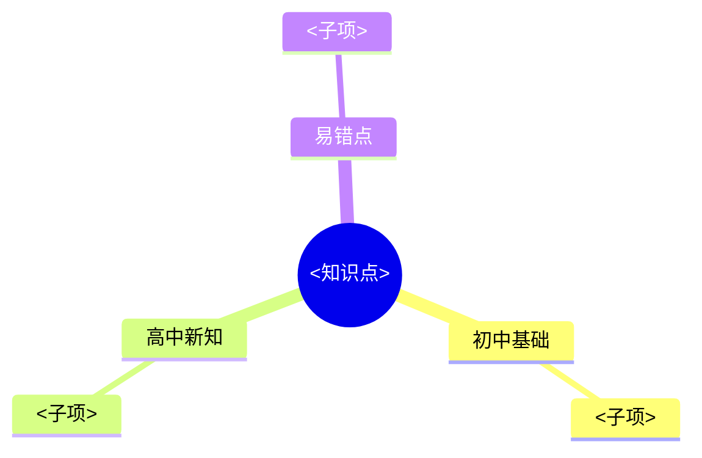

# <知识点>

> 章节归属：<科目> 第 X 章 X.X 节
> 难度基线：高一入门
> 生成日期：YYYY-MM-DD

## 初中基础

<衔接初中已学知识。形式：先问"你在初中学过______还记得吗？"再简述相关旧知。>

## 高中新知

<新概念定义 + 生活/物理例子。若适合可视化，提示学生在对话中向 Claude 索取 Python 脚本或打开 demo.html。>

公式示例：$E = mc^2$

## 例题

<规范思维过程：画图 → 分析 → 列式 → 解答 → 检验。>

## 自检问题

1. <基础复述：用自己的话解释……>
2. <简单应用：条件变成______，结果会怎样？>
3. <辨析反例：有同学说______，你觉得对吗？为什么？>

> 不含答案。学生答错可喊"追问 <知识点>"。

## 思维导图

